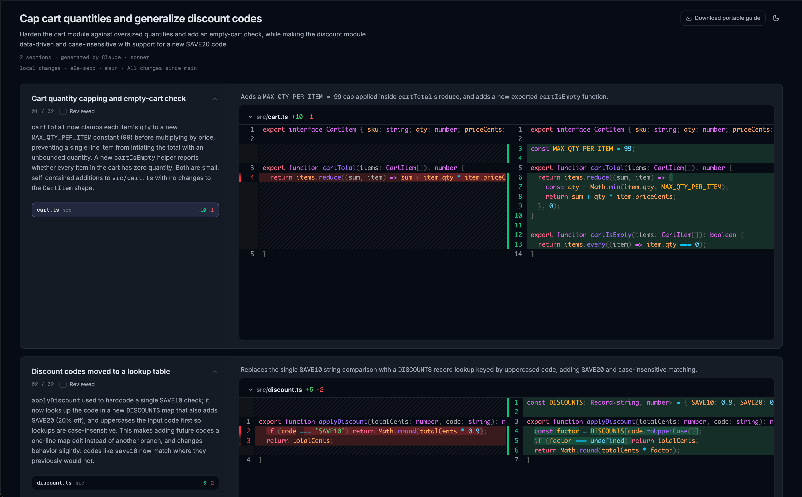

# plannotator-guide

An agent skill that writes a **Guided Review**, a chaptered walkthrough of a diff, and exports it as a single portable HTML file.

Share the HTML or use the optional, encrypted, share service:
  - (optional) the guide is uploaded to [guides.show](https://guides.show) encrypted; the server can't read it, only people with the link can.

This is also built into [Plannotator Code Review](https://github.com/backnotprop/plannotator)

<a href="https://github.com/backnotprop/plannotator"></a>

## Install

```bash
npx skills add plannotator/guides
```

Also needs git and the plannotator CLI (the minimal install is enough if you don't use the Plannotator UI):

```bash
curl -fsSL https://plannotator.ai/install.sh | bash -s -- --minimal
```

## Use

Ask your agent for a guide, walkthrough, or tour of a branch, PR, commit, or uncommitted work. It saves the diff, writes `guide.json`, runs the export, and gives you the path to the HTML. Open it in any browser, or run the same thing from a PR pipeline with whichever agent you use there.

The guide shape and the full flow are in [`skills/plannotator-guide/SKILL.md`](skills/plannotator-guide/SKILL.md).

## How it works under the hood

The agent reads the diff and writes the guide. The [plannotator](https://plannotator.ai) CLI validates it, adds repo, branch and commit, and writes the HTML:

```bash
plannotator guide export --guide guide.json --patch guide.patch
```

For a link instead of a file:

```bash
plannotator guide share --guide guide.json --patch guide.patch
```

That prints the URL and a delete token. The key is the part of the URL after `#`, which browsers never send to the server, so guides.show only ever holds encrypted data. `--public` skips the encryption so chat apps can show a preview. `plannotator guide unshare <id> --token <token>` removes it. Nothing is uploaded unless you ask for a link.

The code that displays a guide loads from guides.show and never changes out from under a file, so old files keep working. guides.show itself is a small Cloudflare Worker you can run yourself; see [`apps/guides-show`](https://github.com/backnotprop/plannotator/tree/main/apps/guides-show) in the Plannotator repo and set `PLANNOTATOR_GUIDE_SHARE_URL` to your own host.

## What one looks like



## Related

- [Portable guide format](https://plannotator.ai/docs/reference/portable-guides/): what is in the file, the snapshot format, share links, and guides.show.
- [Plannotator](https://github.com/backnotprop/plannotator): the review tool that generates these guides in-app.

Diffs are rendered with [diffs.com](https://diffs.com/).
